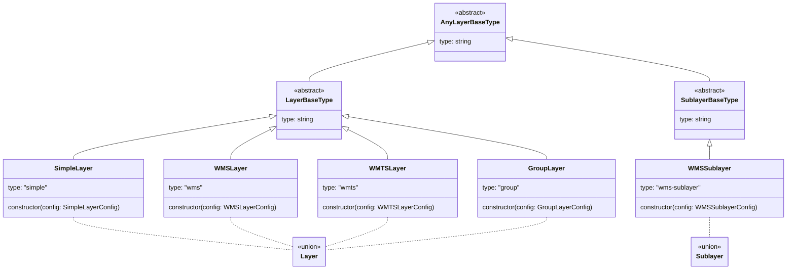

# @open-pioneer/map

This package integrates [OpenLayers](https://openlayers.org/) maps into an Open Pioneer Trails application.
APIs provided by this package can be used to configure, embed and access the map and its contents.

## Usage

To use a map in your app, follow these steps:

- Add a `MapContainer` component to your app (see [Map container component](#map-container-component)).
- Create a map and set a configuration (see [Map configuration](#map-configuration)).

There are two different ways to create a map ( see [Map creation](#map-creation) )

- Implement a `MapConfigProvider` (see [Implement a MapConfigProvider](#implement-a-mapconfigprovider)).
- Directly create a `MapModel` instance (see [Direct mapModel](#create-a-mapmodel-instance-directly))

To access or manipulate the content of the map programmatically, see [Using the map model](#using-the-map-model).

### Map container component

To integrate a `MapContainer` in an app, add the component to your React component, where you want the map to appear.
A `MapContainer` requires a `map` reference to be specified to know which map to display.
The `map` reference can be specified directly on the component (prop `map`) or by using the `DefaultMapProvider` (see [Using the `DefaultMapProvider`](#using-the-defaultmapprovider)).

Make sure that the parent component has an appropriate width and height (for example `100%`).
The `MapContainer` fills the entire available space.

Example: Integration of a map container with a given map (for an example with `DefaultMapProvider` see [Using the `DefaultMapProvider`](#using-the-defaultmapprovider):

```jsx
import { Box } from "@chakra-ui/react";
import { MapContainer, useMapModel } from "@open-pioneer/map";
// ...
function AppUI() {
    const { map } = useMapModelValue();

    return (
        <Box height="100%" overflow="hidden">
            <MapContainer map={map} />
        </Box>
    );
}
```

> NOTE: If you use `useMapModelValue` There must be a `map.MapConfigProvider` or the map has to be created by you directly (see [Map creation](#map-creation)).

The component itself uses the map registry service to create the map using the provided `map`.

#### Changing the map view's padding

The MapContainer provides a prop `viewPadding` that allows to set the map's view padding
(see [padding property on OL View](https://openlayers.org/en/latest/apidoc/module-ol_View-View.html#padding)).
This prop must be used to set the view's padding instead of directly setting the padding on the
OL map's view to ensure that map anchors are positioned correctly.

Additionally, using the prop `viewPaddingChangeBehavior` it is possible to specify how the map behaves when the view padding changes.
Possible values are `none` (do nothing), `preserve-center` (ensures that the center point remains the same
by animating the view) and `preserve-extent` (ensures that the extent remains the same by zooming).

By default, the focus outline of the map container also respects the view padding.
If you want to disable the focus outline, you can use the following css style:

```css
.map-container-root:has(> .map-container:focus-visible) .map-anchors::after {
    outline: none;
}
```

In this case, you will need to create an appropriate outline style for the map container yourself.

### Map anchor component

To pass custom React components onto the map, the following anchor-points are provided:

- `manual`
- `top-left`
- `top-right`
- `top-center`
- `bottom-left`
- `bottom-right`
- `bottom-center`
- `left-center`
- `right-center`
- `center`

Example: Integration of a map anchor component into the map container with position `bottom-right` and optional horizontal and vertical gap:

```jsx
<MapContainer map={map}>
    <MapAnchor position="bottom-right" horizontalGap={25} verticalGap={25}>
        ... {/** add map anchor content like other React components */}
    </MapAnchor>
</MapContainer>
```

The component itself calculates the `maxHeight` and `maxWidth` according to the map view padding and optional `horizontalGap`and `verticalGap` to avoid content overflow.
In this case, the CSS property `overflow` is set to `hidden` to the map anchor component.
If no `verticalGap` is configured, a default vertical gap of `30px` is used.

> NOTE: To get the correct tab order, add the container anchor-points before other components.

By default, certain pointer events from map anchor children (such as `pointer-down`) are stopped from bubbling up towards the map.
This is done to "hide" those events from map interactions (such as drawing): this makes it possible to click into text or controls within a map anchor without interacting with the map.
This behavior can be disabled by setting the `stopEvents` property to `false`:

```jsx
<MapAnchor position="top-right" stopEvents={false}>
    {/* Click events etc. will be seen by the map. This could be appropriate for non-interactive text-only overlays, for example. */}
</MapAnchor>
```

### Using the DefaultMapProvider

You can use the `DefaultMapProvider` to globally specify the `map` in your application's UI.
The `map` is passed to all subcomponents, including the `MapContainer`.
Thus, it is not necessary to provide the `map` on each component separately.

Example:

```tsx
import { DefaultMapProvider } from "@open-pioneer/map";

<DefaultMapProvider map={map}>
    {/* no need to repeat the map in this subtree, unless you want to use a different one */}
    <MapContainer />
    <Toc />
    <ComplexChild />
</DefaultMapProvider>;
```

If an app only contains a single map, the map provider can surround the whole application's UI.
If multiple maps are used, the provider can be placed around the respective map components that should interact with the corresponding app.

It is possible to override the `map` on each component if some components in the tree should use a different map.

### Map creation

There are two different ways to create a map Model. Either by implementing a `MapConfigProvider`
(see [Implement a MapConfigProvider](#implement-a-mapconfigprovider)) or by directly creating a `MapModel` instance
(see [Create a MapModel instance directly](#create-a-mapmodel-instance-directly))).
The latter approach is useful if you manage your app state with an app model and want to
control the map model programmatically. The MapconfigProvider approach is more declarative and useful
if you want to configure the map once and don't need to change it often depending on your app state.

#### Create a MapModel instance directly

It can be usefull to create a `MapModel` instance directly, for example if you want to manage your app
state with an app model and want to control the map model programmatically. E.g. if you want to add or remove layers
after a user interaction.
Here is an example of how to create a `MapModel` instance directly in an app model.

```tsx
import { ServiceOptions } from "@open-pioneer/runtime";
interface References {
    mapRegistry: MapRegistry;
}
export class AppModel implements Service {
    declare [DECLARE_SERVICE_INTERFACE]: "example.AppModel";
    constructor({ references }: ServiceOptions<References>) {
        this._mapRegistry = references.mapRegistry;
        this._mapRegistry
            .createMapModel("myMapModelId", {
                /* map config */
            })
            .then((map) => {
                // use the map model instance
            });
    }
}
```

The map config is the same as in the `MapConfigProvider` (see [Map configuration](#map-configuration)).

To get the mapRegistry service, you need to add a reference to the build config:

```js
// build.config.mjs
import { defineBuildConfig } from "@open-pioneer/build-support";
export default defineBuildConfig({
    services: {
        AppModel: {
            provides: "example.AppModel",
            references: {
                mapRegistry: "map.MapRegistry"
            }
        }
    }
});
```

It is also possible to destroy the map model instance again by calling `mapModel.destroy()`.

### Implement a MapConfigProvider

Another way to create a map is to implement a `MapConfigProvider`.
The MapconfigProvider approach is more declarative and useful
if you want to configure the map once and don't need to change it often depending on your app state.

```ts
// YOUR-APP/MapConfigProviderImpl.ts
import { MapConfig, MapConfigProvider } from "@open-pioneer/map";

export class MapConfigProviderImpl implements MapConfigProvider {
    async getMapConfig(): Promise<MapConfig> {
        return {
            /* map config */
        };
    }
}
```

You need to register the service in your app's build config:

```js
// build.config.mjs
import { defineBuildConfig } from "@open-pioneer/build-support";

export default defineBuildConfig({
    services: {
        MapConfigProviderImpl: {
            // Registers the service as a config provider
            provides: ["map.MapConfigProvider"]
        }
    },
    ui: {
        references: ["map.MapRegistry"]
    }
});
```

### Map configuration

Independent of the way the map is created (either via `MapConfigProvider` or directly), a map configuration must be provided.
The following map options are supported:

- `initialView`,
- `projection`,
- `layers` (see [Layer configuration](#layer-configuration)),
- `advanced`

Always use the provided map model to access the map initially.
Use `.olMap` only, when the raw instance is required.

If an advanced configuration (fully constructed `OlView` instance) is used, some options (such as `initialView` or `projection`) cannot be applied anymore.

We will show some example configurations with a MapConfigProvider implementation.
These configurations can also be used when creating a MapModel instance directly.

Example: Implementation of the service with `initialView.kind = position`.

```ts
// YOUR-APP/MapConfigProviderImpl.ts
import { MapConfig, MapConfigProvider } from "@open-pioneer/map";

export class MapConfigProviderImpl implements MapConfigProvider {
    async getMapConfig(): Promise<MapConfig> {
        return {
            initialView: {
                kind: "position",
                center: { x: 847541, y: 6793584 },
                zoom: 14
            },
            projection: "EPSG:3857",
            layers: [
                // ...
            ]
        };
    }
}
```

Example: Implementation of the service with `initialView.kind = extent`.

```ts
// YOUR-APP/MapConfigProviderImpl.ts
import { MapConfig, MapConfigProvider } from "@open-pioneer/map";

export class MapConfigProviderImpl implements MapConfigProvider {
    async getMapConfig(): Promise<MapConfig> {
        return {
            initialView: {
                kind: "extent",
                extent: {
                    xMin: 577252,
                    yMin: 6026906,
                    xMax: 1790460,
                    yMax: 7318386
                }
            },
            projection: "EPSG:3857",
            layers: [
                // ...
            ]
        };
    }
}
```

Example: Implementation of the service with an advanced configuration.

```ts
// YOUR-APP/MapConfigProviderImpl.ts
import { MapConfig, MapConfigProvider } from "@open-pioneer/map";

export class MapConfigProviderImpl implements MapConfigProvider {
    async getMapConfig(): Promise<MapConfig> {
        return {
            advanced: {
                view: new View({
                    center: [405948.17, 5757572.85],
                    zoom: 5
                })
            },
            layers: [
                // ...
            ]
        };
    }
}
```

> IMPORTANT: Not all OpenLayers [View](https://openlayers.org/en/latest/apidoc/module-ol_View-View.html) properties are supported.
> For example, you cannot set the target because the target is controlled by the `<MapContainer />`.

#### Layer configuration

Configure your custom layer inside the [Map configuration](#map-configuration) by using one of the layer types provided by this package.
For example, `SimpleLayer` can be used to configure an arbitrary [`OpenLayers Layer`](https://openlayers.org/en/latest/apidoc/module-ol_layer_Layer-Layer.html) as `olLayer` property.

Layers are constructed via the `LayerFactory`.
You can access the layer factory from within a `MapConfigProvider` or inject it via `"map.LayerFactory"`.

Example: Create a layer using the layer factory.

```ts
const layerFactory = ...;
layerFactory.create({
    type: SimpleLayer, // Layer type: mandatory

    // Any properties supported by the layer type
    title: "OSM",
    id: "osm",
    isBaseLayer: true,
    olLayer: new TileLayer({
        source: new OSM()
    })
}),
```

Example: Implementation of a layer configuration.

```ts
// YOUR-APP/MapConfigProviderImpl.ts
import {
    MapConfig,
    MapConfigProvider,
    MapConfigProviderOptions,
    SimpleLayer
} from "@open-pioneer/map";
import TileLayer from "ol/layer/Tile";
import OSM from "ol/source/OSM";

export class MapConfigProviderImpl implements MapConfigProvider {
    async getMapConfig({ layerFactory }: MapConfigProviderOptions): Promise<MapConfig> {
        return {
            layers: [
                layerFactory.create({
                    // minimal layer configuration
                    type: SimpleLayer,
                    title: "OSM",
                    olLayer: new TileLayer({
                        source: new OSM()
                    })
                }),
                layerFactory.create({
                    // layer configuration with optional properties
                    type: SimpleLayer,
                    id: "abe0e3f8-0ba2-409c-b6b4-9d8429c732e3",
                    title: "OSM with UUID",
                    olLayer: new TileLayer({
                        source: new OSM()
                    }),
                    attributes: {
                        foo: "bar"
                    },
                    description: "additional description",
                    isBaseLayer: false,
                    visible: false
                })
            ]
        };
    }
}
```

> **Layer Order**
>
> By default, layers are displayed in the order in which they are defined in the `layers` array.
> The later a layer is listed in the array, the higher up it is displayed in the map.
>
> Base layers are excluded from this rule: they are always displayed below all operational layers.

Based on the example above, you can set different properties using the layer API (such as setting visibility, update custom metadata (`attributes`)).

Example: How to set different properties.

```js
import { useMapModelValue } from "@open-pioneer/map";

const map = useMapModelValue();
const layer = map.layers.getLayerById("abe0e3f8-0ba2-409c-b6b4-9d8429c732e3");

layer.setDescription("new description");
layer.setTitle("new title");
layer.setVisible(true);
layer.updateAttributes({
    foo: "bar"
});
layer.deleteAttribute("foo");
```

An optional property `healthCheck` allows to determine the availability status of a layer (e.g. map service down). The health check is performed asynchronous.

It is possible to provide

- either a URL to perform a test request check the returned HTTP status
- or a `HealthCheckFunction` performing a custom check and returning the state

**Important**: The availability of a layer is only checked once during initialization to reduce the load on server side. If a service becomes available again later, the application will need to be reloaded in order to update the availability status.

The availability status of a layer can be accessed with the property `loadState`. Its value depends on the result of the health check and the OpenLayers `Source` of the layer. If at least one of both checks returns the state `error`, the `loadState` will be set to `error`.

Example: Check of layer availability ("health check")

```ts
// YOUR-APP/MapConfigProviderImpl.ts
import {
    MapConfig,
    MapConfigProvider,
    MapConfigProviderOptions,
    SimpleLayer
} from "@open-pioneer/map";
import TileLayer from "ol/layer/Tile";
import OSM from "ol/source/OSM";

export class MapConfigProviderImpl implements MapConfigProvider {
    async getMapConfig({ layerFactory }: MapConfigProviderOptions): Promise<MapConfig> {
        return {
            layers: [
                layerFactory.create({
                    type: SimpleLayer,
                    id: "1",
                    title: "Layer 1",
                    olLayer: new TileLayer({
                        source: new OSM()
                    }),
                    // check layer availability by requesting the provided URL
                    healthCheck:
                        "https://sgx.geodatenzentrum.de/wmts_topplus_open/1.0.0/WMTSCapabilities.xml",
                    isBaseLayer: false,
                    visible: true
                }),
                layerFactory.create({
                    type: SimpleLayer,
                    id: "2",
                    title: "Layer 2",
                    olLayer: new TileLayer({
                        source: new OSM()
                    }),
                    // check layer availability by providing a custom health check function
                    healthCheck: async () => {
                        function wait(milliseconds: number): Promise<void> {
                            return new Promise((resolve) => setTimeout(resolve, milliseconds));
                        }

                        await wait(3000);
                        return "error";
                    },
                    isBaseLayer: false,
                    visible: false
                })
            ]
        };
    }
}
```

> NOTE: The visibility of base layers cannot be changed through the method `setVisible`.
> Call `activateBaseLayer` instead.

##### OGC API Features

To create an OGC API Features layer, use the `ogc-features` package.
Details about the necessary steps are described in the package's [README](../ogc-features/README.md) file.

###### Mapbox / MapLibre styles

To use layers of a Mapbox / MapLibre style document, use the class `MapboxVectorLayer` from the package `ol-mapbox-style` as in the following sample:

```ts
// YOUR-APP/MapConfigProviderImpl.ts
import { MapboxVectorLayer } from "ol-mapbox-style";

export const MAP_ID = "main";

export class MapConfigProviderImpl implements MapConfigProvider {
    mapId = MAP_ID;

    async getMapConfig({ layerFactory }: MapConfigProviderOptions): Promise<MapConfig> {
        return {
            projection: "EPSG:3857",
            initialView: {
                kind: "position",
                center: {
                    x: 848890,
                    y: 6793350
                },
                zoom: 13
            },
            layers: [
                layerFactory.create({
                    type: SimpleLayer,
                    title: "Abschnitte/Äste mit Unfällen (Mapbox Style)",
                    olLayer: new MapboxVectorLayer({
                        styleUrl:
                            "https://sgx.geodatenzentrum.de/gdz_basemapde_vektor/styles/bm_web_top.json"
                    })
                })
            ]
        };
    }
}
```

Because of the changed license of Mapbox as of version 2.0, we recommend to override the implementation with the code of MapLibre (see the main package.json of this repository for a sample).

##### OGC API Tiles

OpenLayers supports OGC API Tiles (vector tiles) by default (see [OpenLayers API](https://openlayers.org/en/latest/apidoc/module-ol_source_OGCVectorTile-OGCVectorTile.html)).

> IMPORTANT: The configured vector tile layer must have the same projection like the map. Otherwise OGC API Tiles cannot be displayed correctly in a map.

Example: How to configure a vector tile layer:

```ts
// YOUR-APP/MapConfigProviderImpl.ts
export class MapConfigProviderImpl implements MapConfigProvider {
    async getMapConfig({ layerFactory }: MapConfigProviderOptions): Promise<MapConfig> {
        return {
            projection: "EPSG:3857",
            initialView: {
                kind: "position",
                center: {
                    x: 848890,
                    y: 6793350
                },
                zoom: 13
            },
            layers: [
                layerFactory.create({
                    type: SimpleLayer,
                    title: "Pendleratlas",
                    visible: true,
                    olLayer: new VectorTileLayer({
                        source: new VectorTileSource({
                            url: "https://pendleratlas.statistikportal.de/_vector_tiles/2022/vg250/{z}/{x}/{y}.pbf",
                            format: new MVT(),
                            projection: "EPSG:3857"
                        }),
                        style: new Style({
                            fill: new Fill({
                                color: "rgba(173, 209, 158, 0.6)"
                            }),
                            stroke: new Stroke({
                                color: "#2d7d9f",
                                width: 3
                            })
                        })
                    })
                })
            ]
        };
    }
}
```

##### OGC Web Map Tile Service (WMTS)

To create a layer configuration for a WMTS, use one of the following configuration approaches:

1. Predefine options
2. Request options from the services capabilities (see [OpenLayers API](https://openlayers.org/en/latest/apidoc/module-ol_source_WMTS.html#.optionsFromCapabilities))

Predefining the options results in faster startup of your application and prevents the startup process from being interrupted when a service is temporarily unavailable.
Requesting the options from the capabilities has the advantage that you do not have to track and adjust changes in the services' metadata and can integrate a service with less code.

Example: How to predefine all necessary options for a WMTS layer:

```ts
// YOUR-APP/MapConfigProviderImpl.ts
export const MAP_ID = "main";

/**
 * Register custom projection to the global proj4js definitions.
 */
registerProjections({
    "EPSG:31466":
        "+proj=tmerc +lat_0=0 +lon_0=6 +k=1 +x_0=2500000 +y_0=0 +ellps=bessel +nadgrids=BETA2007.gsb +units=m +no_defs +type=crs"
});

export class MapConfigProviderImpl implements MapConfigProvider {
    mapId = MAP_ID;

    async getMapConfig({ layerFactory }: MapConfigProviderOptions): Promise<MapConfig> {
        return {
            initialView: {
                kind: "position",
                center: { x: 404747, y: 5757920 },
                zoom: 14
            },
            projection: "EPSG:31466",
            layers: [
                layerFactory.create({
                    type: SimpleLayer,
                    id: "topplus_open",
                    title: "TopPlus Open",
                    isBaseLayer: true,
                    visible: true,
                    layer: new TileLayer({
                        source: createWMTSSource("web")
                    })
                })
            ]
        };
    }
}

function createWMTSSource(layer: "web" | "web_grau" | "web_light") {
    const topLeftCorner = [-3803165.98427299, 8805908.08284866];

    /**
     * Resolutions taken from AdV WMTS-Profil
     * @see https://www.adv-online.de/AdV-Produkte/Standards-und-Produktblaetter/AdV-Profile/
     */
    const resolutions = [
        4891.96981025128, // AdV-Level 0  (1:17471320.7508974)
        2445.98490512564, // AdV-Level 1  (1:8735660.37544872)
        1222.99245256282, // AdV-Level 2  (1:4367830.18772436)
        611.49622628141, // AdV-Level 3   (1:2183915.09386218)
        305.748113140705, // AdV-Level 4  (1:1091957.54693109)
        152.874056570353, // AdV-Level 5  (1:545978.773465545)
        76.4370282851763, // AdV-Level 6  (1:272989,386732772)
        38.2185141425881, // AdV-Level 7  (1:136494,693366386)
        19.1092570712941, // AdV-Level 8  (1:68247,3466831931)
        9.55462853564703, // AdV-Level 9  (1:34123,6733415966)
        4.77731426782352, // AdV-Level 10 (1:17061,8366707983)
        2.38865713391176, // AdV-Level 11 (1:8530,91833539914)
        1.19432856695588, // AdV-Level 12 (1:4265,45916769957)
        0.59716428347794 // AdV-Level 13 (1:2132,72958384978)
    ];

    /**
     * The length of matrixIds needs to match the length of the resolutions array
     * @see https://openlayers.org/en/latest/apidoc/module-ol_tilegrid_WMTS-WMTSTileGrid.html
     */
    const matrixIds = new Array(resolutions.length);
    for (let i = 0; i < resolutions.length; i++) {
        matrixIds[i] = i;
    }

    return new WMTS({
        url: `https://sgx.geodatenzentrum.de/wmts_topplus_open/tile/1.0.0/${layer}/{Style}/{TileMatrixSet}/{TileMatrix}/{TileRow}/{TileCol}.png`,
        layer: "web_grau",
        matrixSet: "EU_EPSG_25832_TOPPLUS",
        format: "image/png",
        projection: "EPSG:25832",
        requestEncoding: "REST",
        tileGrid: new WMTSTileGrid({
            origin: topLeftCorner,
            resolutions: resolutions,
            matrixIds: matrixIds
        }),
        style: "default",
        attributions: `Kartendarstellung und Präsentationsgraphiken: © Bundesamt für Kartographie und Geodäsie ${new Date().getFullYear()}, <a href="https://sg.geodatenzentrum.de/web_public/gdz/datenquellen/Datenquellen_TopPlusOpen.html" target="_blank">Datenquellen</a>`
    });
}
```

> Note: The WMTS configuration (for example `topLeftCorner` or `matrixSet`) can be different for each service.
> Please have a look into the WMTS capabilities.

Example: How to create the WMTS source from the services capabilities:

```js
// YOUR-APP/SomeFile.ts

// Imports:
import { MapModel, LayerFactory, SimpleLayer, registerProjections } from "@open-pioneer/map";
import WMTSCapabilities from "ol/format/WMTSCapabilities";
import { optionsFromCapabilities } from "ol/source/WMTS";

// Global setup: register UTM32 (only needed for this specific layer)
registerProjections({
    "EPSG:31466":
        "+proj=tmerc +lat_0=0 +lon_0=6 +k=1 +x_0=2500000 +y_0=0 +ellps=bessel +nadgrids=BETA2007.gsb +units=m +no_defs +type=crs"
});

// Later, for example in a service
const mapModel: MapModel = ... // retrieved via MapRegistry service
await mapModel.whenDisplayed();

const layerFactory: LayerFactory = ...; // injected

const response = await httpService.fetch("https://sgx.geodatenzentrum.de/wmts_topplus_open/1.0.0/WMTSCapabilities.xml");
const responseText = await response.text();

const wmtsParser = new WMTSCapabilities();
const wmtsResult = wmtsParser.read(responseText);
const wmtsOptions = optionsFromCapabilities(wmtsResult, {
    layer: "web_light",
    matrixSet: "EU_EPSG_25832_TOPPLUS"
});

if (wmtsOptions) {
    mapModel.layers.addLayer(layerFactory.create({
        type: SimpleLayer,
        id: "topplus_open_optionsFromCapabilities",
        title: "TopPlus Open - created with optionsFromCapabilities()",
        visible: false,
        layer: new TileLayer({
            source: new WMTS(wmtsOptions)
        })
    }));
}
```

> Note: To avoid adding layers twice (or error messages), check against the layer id with `getLayerById()`.

##### OGC Web Map Service (WMS)

To create a layer configuration for a WMS, use the following configuration approach:

Example: Create WMS layer configuration

```ts
// YOUR-APP/MapConfigProviderImpl.ts
import {
    MapConfig,
    MapConfigProvider,
    MapConfigProviderOptions,
    WMSLayer
} from "@open-pioneer/map";

export const MAP_ID = "main";

export class MapConfigProviderImpl implements MapConfigProvider {
    mapId = MAP_ID;

    async getMapConfig({ layerFactory }: MapConfigProviderOptions): Promise<MapConfig> {
        return {
            initialView: {
                kind: "position",
                center: { x: 404747, y: 5757920 },
                zoom: 14
            },
            projection: "EPSG:25832",
            layers: [
                layerFactory.create({
                    type: WMSLayer,
                    title: "Schulstandorte",
                    url: "https://www.wms.nrw.de/wms/wms_nw_inspire-schulen",

                    // Configure service (sub-) layers
                    sublayers: [
                        {
                            name: "US.education",
                            title: "Schulen"
                        }
                    ],

                    // Optional, additional options for the underlying ImageWMS source
                    sourceOptions: {
                        // Ratio 1 means image requests are the size of the map viewport
                        ratio: 1
                    }
                })
            ]
        };
    }
}
```

##### GroupLayer

A `GroupLayer` contains a list of layers (e.g. `SimpleLayer`, `WMSLayer` or nested `GroupLayer`).
The visibility of all layers within the group is controlled via the parent group layer(s).
The hierarchy of the layers, which results from the (nested) groups, is rendered accordingly in the table of contents.

Example: Create (nested) group layers

```ts
import { GroupLayer, SimpleLayer } from "@open-pioneer/map";

const layerFactory = ...; // injected

// Create group layer with a nested sub group
const group = layerFactory.create({
    type: GroupLayer,
    id: "group",
    title: "a group layer",
    layers: [
        layerFactory.create({
            type: SimpleLayer,
            id: "member",
            title: "group member",
            olLayer: olLayer1
        }),
        layerFactory.create({
            type: GroupLayer,
            id: "subgroup",
            title: "a nested group layer",
            layers: [
                layerFactory.create({
                    type: SimpleLayer,
                    id: "submember",
                    title: "subgroup member",
                    olLayer: olLayer2
                })
            ]
        })
    ]
});

const childLayers = group.layers; // Access child layers
```

> Limitations:
>
> - Do not add or remove layers directly to or from the underlying OpenLayers layer group (`group.olLayer`)! Changes are not synchronized with the `GroupLayer` instance.
> - Currently, it is not possible to manipulate (add or remove) the child layers of a `GroupLayer` during runtime.

#### Register additional projections

The map supports only the following projections by default: `EPSG:4326`, `EPSG:3857`, `EPSG:25832` and `EPSG:25833`.
To register additional projections to use them for the map, use the `registerProjections` function.

Example: How to register an additional projection to the global [proj4js](https://github.com/proj4js/proj4js) definition set by name (such as `"EPSG:4326"`) and projection definition (string defining the projection or an existing proj4 definition object):

```ts
import { registerProjections } from "@open-pioneer/map";

registerProjections({
    "EPSG:31466":
        "+proj=tmerc +lat_0=0 +lon_0=6 +k=1 +x_0=2500000 +y_0=0 +ellps=bessel +nadgrids=BETA2007.gsb +units=m +no_defs +type=crs"
    // ... more projections
});
```

Projection definitions can be accessed by the [epsg.io](https://epsg.io/) website or by searching the global [proj4js](https://github.com/proj4js/proj4js) definition set with a valid name.

Example: How to use the registered projection:

```ts
import { getProjection } from "@open-pioneer/map";

// Returns a raw proj4 projection definition (or undefined)
const proj = getProjection("EPSG:3035");

// proj can be used as "projection" in "getMapConfig" of MapConfigProvider implementation
```

### Using the map model

This package allows interacting with maps and their layers through multiple interfaces and classes.

The most important API items are as follows:

- The `MapRegistry` service (inject via `"map.MapRegistry"`).
  This service is used to obtain a reference to the `MapModel` via `registry.getMapModel(mapId)`.

    > NOTE: From inside a React component you can also use the hook `useMapModel(mapId)` (or `useMapModelValue()` if using the DefaultMapProvider).

- The `MapModel` represents a map in an application.
  Through the `MapModel` one can obtain the map's base layers, operational layers and so on.
  The `MapModel` also provides access to the raw OpenLayers `olMap` for advanced use cases.

    > NOTE: The `olMap` is manipulated by the `MapModel` to implement its functionality (for example, to add or remove layer instances). When using the `olMap` directly, treat it carefully and as a shared resource.

- The `LayerFactory` is used to create layer instances (`LayerFactory.create()`).
  The layer factory is a service that can be injected via `"map.LayerFactory"`.
  Your `MapConfigProvider` implementation also receives a reference to the layer factory for convenience.

- The `Layer` interface and its various implementations.
  This interface is used to make common properties and methods available (such as `.title`, or `.setVisible`).
  Layers may also have `.sublayers`, which support the same basic properties as other layer types.

    As is the case in `MapModel`, one can retrieve the raw OpenLayers `olLayer` from a layer instance (the same restrictions apply, see above).

As a general rule of thumb, one should always prefer to use properties or methods provided by this package (if available) instead of manipulating the raw OpenLayers instances.
Manipulating raw instances directly may lead to unexpected results.
For example, other application components may not react to raw property changes correctly because they expect an "official" property to be changed instead.

This point is especially important for the map model's central features:

- Map composition (access and configuration of layers, base layers, removing layers)
- Layer visibility
- Custom layer metadata (`attributes`)

In those cases, the properties or methods provided by this package should always be used:

- `map.layers.addLayer(layer)` and `map.layers.removeLayerById(layerId)` to add or remove layers
- `map.layers.getLayers()`, `map.layers.getBaseLayers()`, `map.layers.getOperationalLayers()` etc. to access (top-level) layers
- `layer.setVisible(visible)` and `map.layers.activateBaseLayer(layerId)` to control visibility
- `layer.updateAttributes()` and `layer.deleteAttributes()` to change a layer's custom attributes

#### Layer classes

This package currently provides five layer implementations: `SimpleLayer`, `WMSLayer`, `WMTSLayer`, `GroupLayer` and `WMSSublayer`.

The following diagram shows the inheritance structure of the corresponding layer types. The diagram is only intended to show the hierarchy of the layer types; for details on the properties and methods of the layer types, refer to the respective API documentation.



#### Using the map model and layers in services

Example: Center map to given coordinates using the map model and set layer visibility using the layer instance.

```ts
import { ServiceOptions } from "@open-pioneer/runtime";
import { MAP_ID } from "./MapConfigProviderImpl";
import type { MapRegistry } from "@open-pioneer/map";

interface References {
    mapRegistry: MapRegistry;
}

export class TestService {
    private registry: MapRegistry;

    constructor(options: ServiceOptions<References>) {
        this.registry = options.references.mapRegistry;
    }

    async centerBerlin() {
        const model = await this.registry.getMapModel(MAP_ID);
        model?.olMap?.getView().fit([1489200, 6894026, 1489200, 6894026], { maxZoom: 13 });
    }

    async setLayerVisible() {
        const model = await this.registry.getMapModel(MAP_ID);
        const layer = model?.layers.getLayerById("abe0e3f8-0ba2-409c-b6b4-9d8429c732e3");
        layer?.setVisible(true);
    }
}
```

#### Using the map model in React components

To access the map model instance, use the React hooks `useMapModel` or `useMapModelValue`.

- `useMapModelValue` returns the map model specified by a `DefaultMapProvider` parent.
  This is a convenient API to avoid passing the map model as a prop everywhere:

    ```tsx
    function YourComponent() {
        const map = useMapModelValue(); // requires a <DefaultMapProvider /> parent somewhere in the React tree
    }
    ```

- `useMapModel` takes a `mapId` and returns a result.
  The result will ultimately resolve to either a map model or an error (if initialization of the map failed).

    Example: Center map to given coordinates using the map model.

    ```js
    import { useMapModel } from "@open-pioneer/map";
    import { MAP_ID } from "./MapConfigProviderImpl";

    export function AppUI() {
        // mapState.map may be undefined initially, if the map is still configuring.
        // the object may may also be in an "error" state.
        const mapState = useMapModel(MAP_ID);

        const centerBerlin = () => {
            const olMap = mapState.map?.olMap;
            if (olMap) {
                olMap?.getView().fit([1489200, 6894026, 1489200, 6894026], { maxZoom: 13 });
            }
        };
    }
    ```

## License

Apache-2.0 (see `LICENSE` file)
